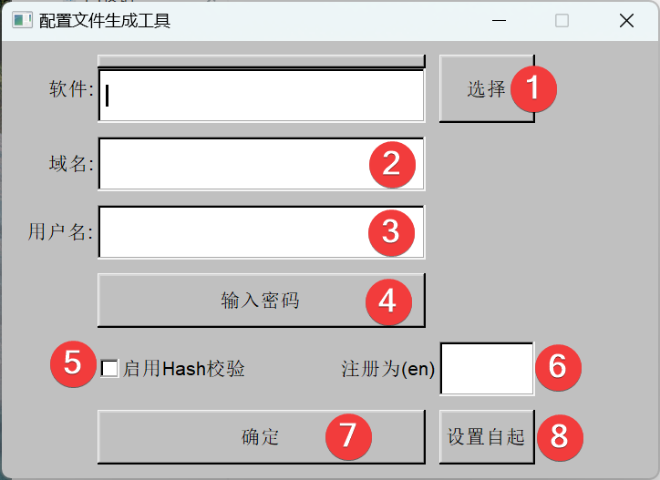

# RunAs

使用 MakeConfigTool 生成加密密码配置文件

使用RunAs 运行

- [X] 22/05/12 修复无法打开中文路径的问题
- [X] 22/05/12 修复自启动Runas开机自启动无法启动目标的问题
- [X] 22/04/17 修复了错误弹窗乱码的Bug
- [X] 22/04/17 添加 添加到开机自启的功能
- [X] 22/04/17 添加 RunAs.exe argv传参到需要启动的程序
- [ ] 添加 修改某一尾缀的缩略图

需要删除自启动 至**HKEY_CURRENT_USERHKEY_LOCAL_MACHIN\SOFTWARE\Microsoft\Windows\CurrentVersion\Run**手动删除

## 使用说明

1. 点击选择 选择需要以管理员运行的程序
2. 域名 需要用域帐号运行时填写，否则留空
3. 用户名 填写拥有管理员权限的帐号名称
4. 点击后 输入密码
5. 如果程序需要更新则不勾选，否则勾选以加强安全性
6. 程序名称等自定义的 只可输入英文
7. 确定后生成配置文件
8. 点击设置自起 如果当前配置未能以管理员 将以管理员启动
然后需要再次点击 以设定

配置完成后双击Runas.exe 以运行指定的程序
(注意：Runas.exe必须和配置文件在同一目录中)